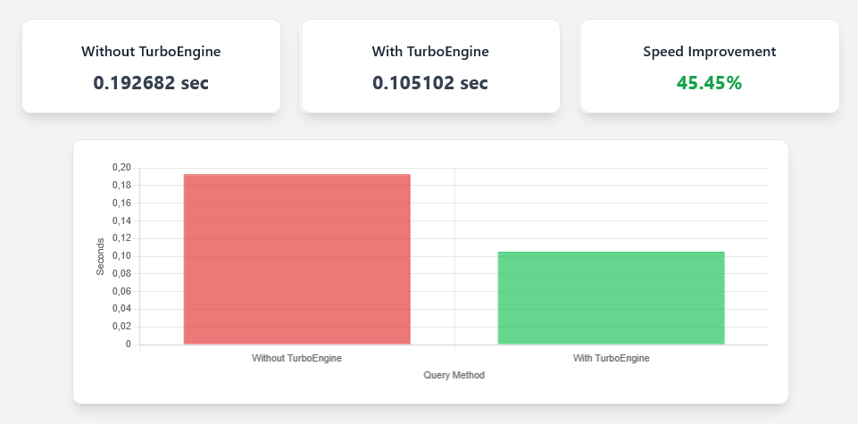

# TurboEngine

<center></center>

TurboEngine is a high-performance Laravel library designed for Big Data projects to enhance database-intensive and data-intensive applications.

TurboEngine is perfect for applications that need to efficiently serve thousands to millions of records with minimal response time.

## Install & Setup

1. Add TurboEngine to your `composer.json`:

```json
"repositories": [
  {
    "type": "path",
    "url": "./TurboEngine",
    "options": {"symlink": true}
  }
]
```

2. Install & publish config:

```bash
composer require fitri-hy/turboengine:dev-main
php artisan vendor:publish --provider="TurboEngine\TurboEngineServiceProvider" --tag=config
```

3. Configure `config/turboengine.php`:

```php
'cache' => ['driver' => 'ram|redis|file', 'ttl' => 300],
'workers' => ['pool_size' => 16],
'predictive' => ['query_prefetch' => true],
'logging' => ['async' => true]
```

## Bootstrap Engine

```php
use TurboEngine\Core\Engine;

$engine = app('turboengine'); 
$engine->run(); // Auto-tune, predictive preloading, traffic analysis
```

## Query Engine (Caching & Optimizer)

```php
$sql = "SELECT * FROM users WHERE status=1";

// Execute cached & optimized query
$result = $engine->queryOptimizer->execute($sql);

// Query profiling
$start = microtime(true);
$engine->query->execute($sql);
$engine->queryProfiler->track($sql, microtime(true)-$start);
```

* Predictive prefetch is automatically enabled if configured.

## Response Engine (Compression & Streaming)

```php
$content = view('dashboard', ['data'=>$data])->render();
$compressed = $engine->response->render($content, 'dashboard_cache');
$engine->streamer::stream(fn() => print($compressed));
```

* Supports **gzip/brotli**, HTTP/2 push, multi-level fragment cache.
* Optimized for pages handling **thousands to hundreds of thousands of records**.

## Async Jobs & Worker Pool

```php
$engine->workerPool->push(fn()=> \Log::info("Async task running"));
$user = $engine->lazyLoader->load("user.123", fn()=> DB::table('users')->find(123));
$engine->jobOptimizer->add('job2',['job1']);
$engine->jobOptimizer->schedule('job1', fn()=> \Log::info('Job1 done'));
$engine->jobOptimizer->schedule('job2', fn()=> \Log::info('Job2 after Job1'));
```

* Perfect for offloading heavy tasks to background workers without blocking the main thread.

## Auto-Tuning & Hot Memory

```php
$engine->autoTuner->tune();
$engine->hotMemoryManager->prioritize(['cache_key_1','cache_key_2']);
```

* Cache TTL and RAM usage are automatically adjusted for optimal performance.

## Predictive ML Modules

```php
$recentHits = $engine->memory->get('recent_hits',[]);
$prediction = $engine->trafficPredictor->predict($recentHits);
$queryPatterns = $engine->queryPatternAnalyzer->analyze([$sql]);
$responsePatterns = $engine->responsePatternAnalyzer->analyze([$content]);
```

* Enables **prefetching and load balancing** using predictive analytics.

## Metrics & Logger

```php
$engine->metrics->record('dashboard_load',0.123);
$loadTimes = $engine->metrics->get('dashboard_load');
\TurboEngine\Helpers\Logger::log('info','Dashboard rendered');
```

* Async logging and real-time metric tracking for performance monitoring.

## Cache Helper (RAM/Redis/File)

```php
\TurboEngine\Helpers\CacheHelper::set('key1',$value,600);
$value = \TurboEngine\Helpers\CacheHelper::get('key1',null);
```

* Ideal for caching queries or views in **Big Data scenarios** to speed up access.

## Features for Big Data

* Multi-level caching
* Query optimizer
* Query profiler
* Predictive prefetch
* Compression (gzip/brotli)
* Streaming responses
* Async jobs
* Worker pool
* Auto-tuning
* Hot memory management
* Predictive ML modules
* Metrics & logging

## Practical Notes

1. Engine automatically bootstraps all modules.
2. Query optimizer + profiler + predictive prefetch → faster database access.
3. Response engine → compress, cache, stream, preload fragments.
4. Async & worker pool → background tasks without blocking.
5. AutoTuner & HotMemoryManager → maintain optimal cache TTL & RAM usage.
6. ML modules → simple predictive preloading and traffic forecasting.
7. Logger & Metrics → async logging and real-time monitoring.

## Folder Structure

```
TurboEngine/
 ├─ src/
 │   ├─ Core/
 │   │   ├─ Engine.php
 │   │   ├─ MemoryManager.php
 │   │   ├─ ConfigManager.php
 │   │   └─ EventManager.php
 │   ├─ Query/
 │   │   ├─ QueryEngine.php
 │   │   ├─ QueryProfiler.php
 │   │   ├─ QueryPredictor.php
 │   │   └─ QueryOptimizer.php
 │   ├─ Response/
 │   │   ├─ ResponseEngine.php
 │   │   ├─ FragmentCache.php
 │   │   ├─ Compressor.php
 │   │   ├─ Streamer.php
 │   │   └─ PredictiveRenderer.php
 │   ├─ Async/
 │   │   ├─ AsyncEngine.php
 │   │   ├─ WorkerPool.php
 │   │   ├─ LazyLoader.php
 │   │   └─ JobOptimizer.php
 │   ├─ Optimization/
 │   │   ├─ Profiler.php
 │   │   ├─ AutoTuner.php
 │   │   ├─ TrafficAnalyzer.php
 │   │   └─ HotMemoryManager.php
 │   ├─ ML/
 │   │   ├─ TrafficPredictor.php
 │   │   ├─ QueryPatternAnalyzer.php
 │   │   └─ ResponsePatternAnalyzer.php
 │   └─ Helpers/
 │       ├─ CacheHelper.php
 │       ├─ MetricsHelper.php
 │       ├─ Utils.php
 │       └─ Logger.php
 ├─ config/
 │   └─ turboengine.php
 ├─ composer.json
 ├─ README.md
 └─ TurboEngineServiceProvider.php
```